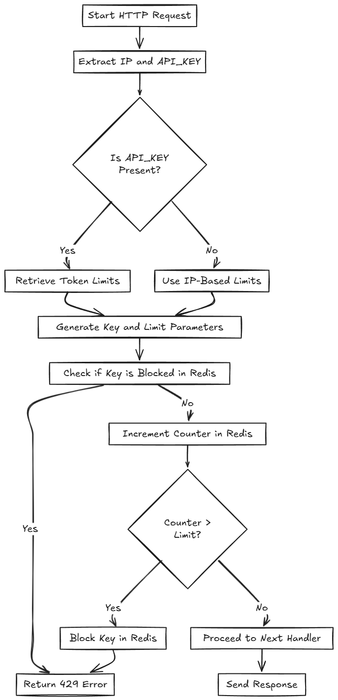

# Rate Limiter in Go

## Introduction

This project is an implementation of a rate limiter in Go that can be configured to limit the maximum number of requests per second based on a specific IP address or an access token. The rate limiter is designed to be used as middleware in a web server, controlling the traffic and ensuring that clients adhere to specified rate limits.

## Features

- **Middleware Integration**: Easily integrates as middleware in your Go gin http server.
- **Configurable Limits**: Set maximum requests per second via environment variables or a `.env` file.
- **IP and Token-based Limiting**: Limits requests based on IP addresses or access tokens.
- **Custom Block Duration**: Configure how long an IP or token is blocked after exceeding the limit.
- **Redis Backend**: Uses Redis for storing limiter data, ensuring high performance and scalability.
- **Pluggable cache service Strategy**: The cache service mechanism can be swapped out with a different backend by implementing a simple interface.
- **Separation of Concerns**: The rate limiting logic is separated from the middleware for cleaner code management.

## Requirements

- Go 1.22 or higher
- Redis server
- Docker and Docker Compose (optional, for running Redis via Docker)

## Installation

1. **Using Docker Compose:**

   ```bash
   docker-compose up -d
   ```

   This will start Redis in a Docker container based on the `docker-compose.yml` file provided.

## Configuration

All configurations are done via environment variables or a `.env` file in the root directory.

1. **Populate the `.env` File**

   Use .env.example as a template:

   ```bash
   cp .env.example .env
   ```

   - **REDIS_ADDR**: Address of the Redis server (default is `localhost:6379`).
   - **REDIS_PASSWORD**: Password for Redis, if any (leave blank if none).
   - **IP_RATE_LIMIT**: Default maximum number of requests per second for IP addresses.
   - **IP_BLOCK_DURATION**: Duration in seconds to block an IP after exceeding the limit.
   - **TOKEN_RATE_LIMIT**: Default maximum number of requests per second for access tokens.
   - **TOKEN_BLOCK_DURATION**: Default duration in seconds to block a token after exceeding the limit.
   - **TOKEN_LIMITS**: JSON string specifying custom limits for specific tokens.
   - **HTTP_ADDR**: Address and port for the HTTP server to listen on.

## Usage

1. **Run the Application**

   ```bash
   docker-compose up -d
   ```

   The server will start and listen on the address specified in the `.env` file (default is `:8080`).

2. **Testing the Rate Limiter**

   - **Without Token (IP-based limiting)**

     Use `curl` or any HTTP client to send requests to the server:

     ```bash
     curl http://localhost:8080/
     ```

     Exceed the `IP_RATE_LIMIT` to see the rate limiter in action.

   - **With Token (Token-based limiting)**

     Include the `API_KEY` header with your requests:

     ```bash
     curl -H "API_KEY: abc123" http://localhost:8080/
     ```

     Exceed the specified token limit to test token-based limiting.

## Examples

### IP-based Limiting

- **Limit**: 5 requests per second per IP.
- **Block Duration**: 5 minutes (300 seconds).

If IP `192.168.1.1` sends 6 requests in one second, the sixth request will receive:

- **HTTP Status Code**: 429
- **Message**: "you have reached the maximum number of requests or actions allowed within a certain time frame"

The IP will be blocked for the next 5 minutes.

### Token-based Limiting

- **Default Limit**: 10 requests per second per token.
- **Custom Token Limit**: Token `abc123` has a limit of 100 requests per second.

If token `abc123` sends 101 requests in one second, the 101st request will receive:

- **HTTP Status Code**: 429
- **Message**: "you have reached the maximum number of requests or actions allowed within a certain time frame"

The token will be blocked for the duration specified (`block_duration`).

## Workflow



## Project Structure

- `main.go`: Entry point of the application. Sets up the server and middleware.
- `ratelimiter/`: Contains the `RateLimiter` struct and middleware logic.
- `cache/`: Defines the `Cache` interface and the `RedisCache` implementation.
- `docker-compose.yml`: Docker Compose file for running Redis.
- `.env`: Configuration file for environment variables.

## Custom Storage Backend

The rate limiter uses a storage interface `CacheService`:

```go
type CacheService interface {
   Increment(ctx context.Context, key string, expiry time.Duration) (int, error)
   Get(ctx context.Context, key string) (int, error)
   SetExpiration(ctx context.Context, key string, expiry time.Duration) error
   IsBlocked(ctx context.Context, key string) (bool, error)
   Block(ctx context.Context, key string, blockDuration time.Duration) error
   Close() error
}
```

To use a different storage backend, implement this interface with your storage mechanism (e.g., in-memory store, database) and update the rate limiter initialization:

```go
customCache := NewYourCustomCache()
rls := ratelimiter.NewRateLimiter(
   customCache,
   options...,
)
```

## Concurrency Considerations

The implementation handles concurrency using Redis atomic operations:

- **Atomic Increment**: The `INCR` command in Redis is atomic, ensuring accurate request counts even under high concurrency.
- **Blocking Checks**: The middleware checks for blocking and increments counters in a way that minimizes race conditions.

## Testing
